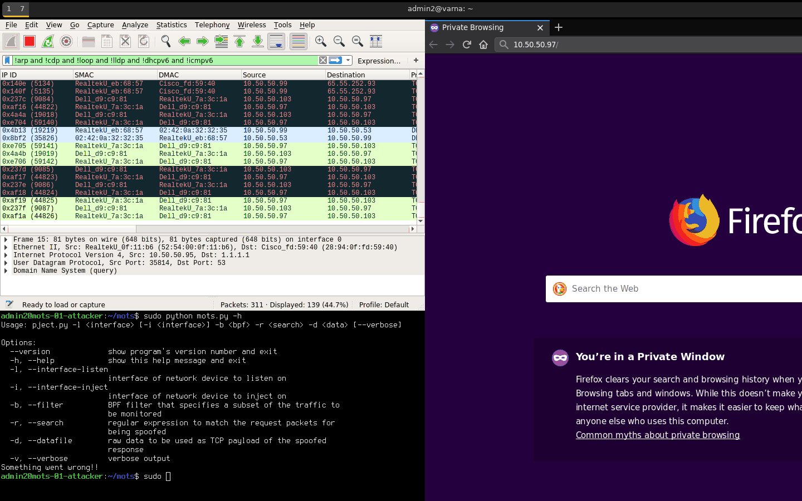

# Man-on-the-Side Attack TCP Injection; HTTP and IEC104

`mots.py` is script that monitors for a trigger, then injects TCP segments. Currently supports HTTP and IEC104. 

# Usage

Requires the following runtime dependencies: 

- Python2
	- scapy
	- binascii
	- netifaces
	- sys
	- optparse

## HTTP

As a privileged user run the following command to inject a HTTP payload, when a `GET /` request is seen.   

	python mots.py -l ens8 -i ens3 -b 'host 10.50.50.97' -r 'GET /' -d payload/http.dat

This listens on interface `ens8`, injects the response using interface `ens3`, uses a Berkeley packet filter (BPF) of `host 10.50.50.97`, and triggers on the string value of 'GET /'. Finally, it reads the contents of `payload/http.dat` that is inserted into the payload.   

## IEC 60870-5-104

As a privileged user run the following command to inject IEC104 payload, when General Interrogation (GI) is seen.   

	python mots.py -l ens8 -i ens3 -b 'port 2404' -r '0x64010701010000000014' -d payload/iec104.dat

This listens on interface `ens8`, injects the response using interface `ens3`, uses a Berkeley packet filter (BPF) of `port 2404`, and triggers on the hex value of the IEC104 GI request `0x64010701010000000014`. Finally, it reads the contents of `payload/iec104.dat` that is inserted into the payload.   

# Payloads

The script will cache the payloads in memory, you will need to restart the script to get any changes.

- http.dat: Injects a simple `PWD` page. 
- http-301.dat: HTTP 301 redirect to example.com.
- iec104.dat: Contains a captured response from WinPP104. (single-point, double-points, and step-position information)
- iec104-two-step-position.dat: Contains two step position. 

# Alternative 

## Implementations

- https://github.com/fox-it/quantuminsert/tree/master/poc/
- https://github.com/stealth/QI
- https://github.com/kevinkoo001/MotS

## Spoofing Tools

- https://linux.die.net/man/8/packit
- http://nemesis.sourceforge.net/
